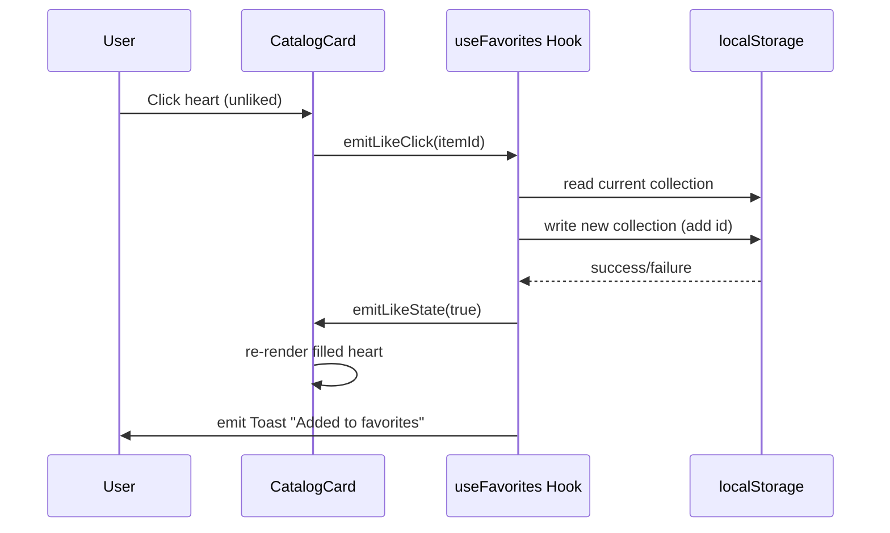

# Contract: Heart Toggle Interactions

**Feature**: `010-favorites-page` | **Date**: 2026-10-03 | **Spec**: [spec.md](./spec.md)

## Overview

This contract defines the user-facing interaction surface for heart-based like/unlike actions across all component contexts in the app. These interactions are implemented via client-side React components with local state and localStorage persistence.

## Component Locations & Contracts

### 1. HeroBanner Heart Toggle

**Location**: `apps/web/src/components/HeroBanner.tsx` (line ~147-156)

**Contract:**

| State | Icon Visual | Button Label | Click Behavior |
|-------|-------------|--------------|----------------|
| Unliked | Outline heart (`<Heart className="w-4 h-4" />`) | "Add to favorites" | Set liked → update local state → write to localStorage → re-render with filled heart |
| Liked | Filled/solid heart (`<Heart className="w-4 h-4 fill-current text-rose-400" />`) | "Remove from favorites" | Set unliked → remove ID from localStorage array → delete localStorage key if empty → re-render with outline heart |

**ARIA Labels:**

- Unliked: `aria-label="Add {title} to favorites"`
- Liked: `aria-label="Remove {title} from favorites"`

**Keyboard Accessible**: Enter or Space activates toggle

---

### 2. CatalogCard Inline Heart Toggle

**Location**: `apps/web/src/components/CatalogCard.tsx` (add new button)

**Contract:**

| State | Icon Visual | Label Placement | Click Behavior |
|-------|-------------|-----------------|----------------|
| Unliked | Outline heart | Bottom-right corner overlay or tooltip on hover | Like item; heart fills instantly without navigation |
| Liked | Filled/solid heart with accent color | Same position; color shift to indicate active | Unlike item; heart unfills instantly |

**Accessibility:**

- Focusable via Tab key
- Active state via `aria-pressed={isLiked}`
- Announced by screen readers as "Favorites, liked" or "Favorites, not liked"

---

### 3. DetailDrawer Heart Toggle

**Location**: `apps/web/src/components/DetailDrawer.tsx` (in footer action row)

**Contract:**

| State | Button Styling | Label | Click Behavior |
|-------|----------------|-------|----------------|
| Unliked | Ghost button + outline heart | "Save to favorites" | Add to likes collection; show toast confirmation ("Added to favorites") |
| Liked | Ghost button + filled rose-colored heart | "Remove from favorites" | Remove from collection; show toast confirmation ("Removed from favorites") |

**Feedback Mechanism:**

- Toast notification (use existing `ToastNotification` component)
- Auto-dismiss after 3 seconds
- User can click "Undo" within 3s to restore like state

---

## Shared Implementation Contract

### LocalStorage Key

```
linkschin:favorites
```

**Format**: `{ items: string[], metadata: { migratedFromWatchlist: boolean, migrationTimestamp: number, version: string } }`

### State Synchronization Rules

1. All components sharing the same `category` and `catalogId` must render consistent heart states
2. Update propagation latency: <50ms across page (using React context: see `useFavorites` hook)
3. On storage error (quota, private mode): show inline warning in details view only (not on cards/hero)

### Event Flow



### Error Handling Contract

| Scenario | Component Response | User Message |
|----------|--------------------|--------------|
| Storage unavailable (private/incognito) | Toggle works but logs warning to console | In details view only: "Likes won't persist in private mode" |
| Corrupt localStorage | Treat collection as empty | Non-blocking toast: "Couldn't load favorites; starting fresh" |
| Network call failure (future API expansion) | Use stale in-memory cache | Retry banner at top of favorites page |

---

## Accessibility Checklist

- [ ] All heart buttons have unique, descriptive `aria-label` containing item title where feasible
- [ ] Keyboard focus ring visible on all interactive hearts
- [ ] Color contrast ratio ≥ 4.5:1 for both outlined and filled heart states
- [ ] Screen reader announces current state ("added", "removed", or "favorite") on activation
- [ ] No reliance on color alone to indicate state (icon shape change also occurs)

---

## Performance Budget

| Action | Max Latency | Measurement Method |
|--------|-------------|---------------------|
| Local toggle state update | <5ms | Chrome DevTools Performance tab |
| localStorage write (batched) | <15ms | `localStorage.setItem()` timing |
| Re-render across components | <50ms | Total time from click to visual sync |

---

## Future Extensibility Notes

- This contract is designed for server-side aggregation later (account-based sync). No breaking changes expected when adding backend persistence layer.
- Migration path to cloud storage: replace `useLocalStorage` implementation in `useFavorites` hook without touching component interfaces.
